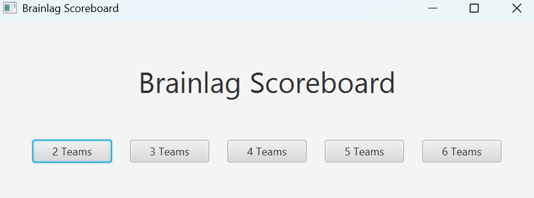
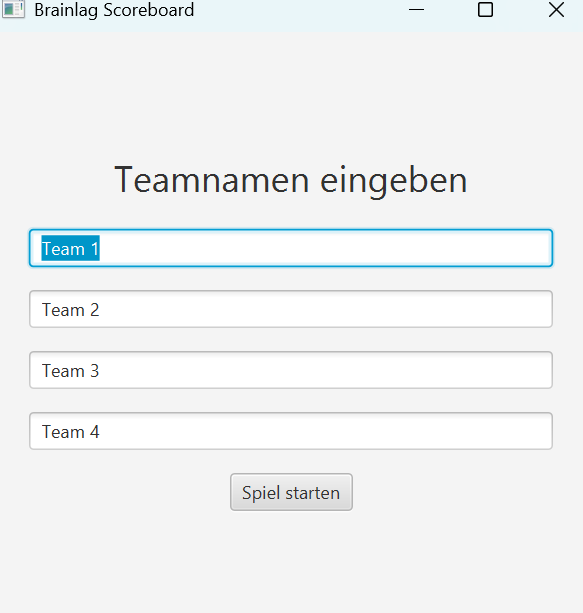
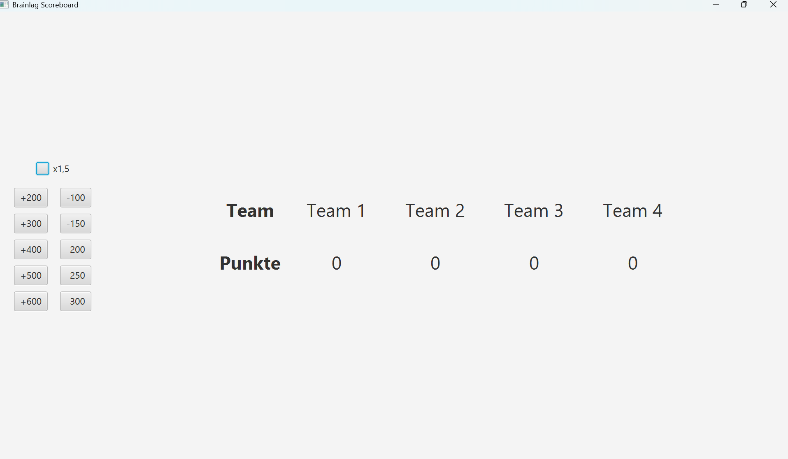

# Punkteanzeige für ein Quizspiel

Das Projekt ist ein JavaFX Dashboard, um die Punkte in einem Quizspiel anzeigen zu können. Dabei kann man sowohl die Anzahl der Teams, als auch deren Namen bestimmen, bevor man zur Punkteübersicht kommt.

## Tech Stack

- Java
- JavaFX
- Maven

## Features

- Teamgröße festlegen
- Teamnamen eintragen
- Punkte verteilen inklusive 1,5 Multiplikator

## Screenshots

